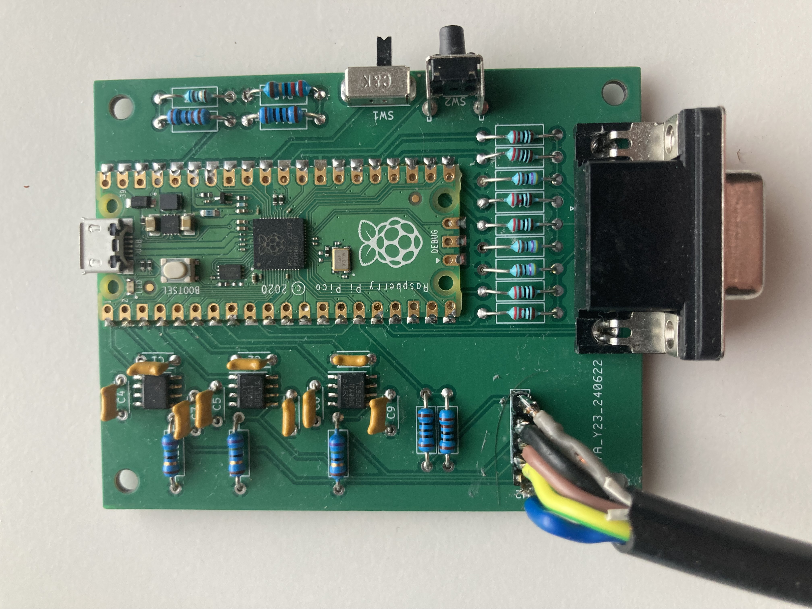

# vga4cpc
VGA output for Amstrad CPC based on Raspberry Pi Pico.   

The goal of this project was to build a scandoubler for Amstrad CPC that is cheap, simple to build and can handle the most popular tricks that Amstrad software does (e.g. smooth scroll) that standard scandoublers usually don't support.
It should work with most LCD monitors. It supports 50.08 FPS to make animations look smoother, but there is also an option to use 60 FPS, if your monitor does not support low frequencies.

Please keep in mind that I am a beginner in electronics, so I could make some serious mistakes. Use it on your own risk.

## Short demo
[https://youtu.be/5xjjsLVpjv0]

## How to build it
Gerber files are in "gerber" directory. I used them with JLCPCB.   
Parts: 
|Symbol|Value|Quantity|Link|
|---|---|---|---|
|U1|Raspberry Pi Pico|1|[https://www.digikey.com/en/products/detail/raspberry-pi/SC0915/13624793]|
|U2-U4|TLV3202 voltage comparators|3|[https://www.digikey.com/en/products/detail/texas-instruments/TLV3202AIDR/3518740]|
|J1|VGA Socket|1|[https://www.digikey.com/en/products/detail/assmann-wsw-components/A-HDF15A-KG-TAXB/1241905] (Actually it did not fit perfectly, but it was possible to mount it)|
|C1-C9|0.1u ceramic capacitors|9|[https://www.digikey.com/en/products/detail/kyocera-avx/SR215C104JAR/2208907]|
|R1-R3|47 ohm resistors|3|[https://www.digikey.com/en/products/detail/stackpole-electronics-inc/RNMF14FTC47R0/2617352]|
|R4,R14|100 ohm resistors|2|[https://www.digikey.com/en/products/detail/yageo/MFR-25FRF52-100R/14795]|
|R5,R12|1 kOhm resistors|2|[https://www.digikey.com/en/products/detail/yageo/MFR-25FRF52-1K/14891]|
|R6-R11|220 Ohm resistors|6||[https://www.digikey.com/en/products/detail/stackpole-electronics-inc/RNMF14FTC220R/2617314]|
|R13|68 Ohm resistor|1|[https://www.digikey.com/en/products/detail/stackpole-electronics-inc/RNMF14FTC68R0/2617372]|
|R15|22 Ohm resistor|1|[https://www.digikey.com/en/products/detail/yageo/MFR-25FTE52-15R/9139795]|
|R16-R18|75 Ohm resistors|3|[https://www.digikey.com/en/products/detail/yageo/MFR-25FBF52-75R/12771]|
|SW1|50/60 FPS switch|1|[https://www.digikey.com/en/products/detail/c-k/OS102011MA1QS1/1981431]|
|SW2|Reset button|1|[https://www.digikey.com/en/products/detail/te-connectivity-alcoswitch-switches/1-1825027-1/1632544]|
|J2|CPC connection header|1|Just install whatever you need to connect to CPC. I used pin headers and soldered cables to them|
||Din 6 or Din 5 plug (center pin is not used) to connect it to Amstrad unless you plan to solder it directly to PCB|1||

  
I wanted to make it easy to solder so almost all parts are TH. Raspberry Pi Pico and comparators are SMD (there was no TH option), but they are quite big and they are simple to solder even without a microscope.
  
You need to connect it to Amstrad video port using J2 connector. The pins are: 1 - blue, 2 - green, 3 - red, 4 - GND, 5 - csync. You can connect din-6/din-5 plug there, or solder directly to Amstrad PCB.
  
After (or before) building the PCB you just need to upload the software to RPI Pico. Connect it with USB cable to PC/Mac, keeping the small button on Pico board pressed. It should mount as a storage device. Just copy uf2 file there. Pico should unmount and restart then.

## How to use it
Connect 5V power adapter (or just cable to USB port in pc) to RPI Pico. Connect VGA cable to monitor. You can connect the board to Amstrad, but don't turn it on yet. You should see test screen with Amstrad palette on top, some potentially problematic patterns on bottom and 4 squares in corners. Make sure it looks OK. In case of any issues you can try to reset the board with SW2 button. It is also a good moment to try switching the V frequency with SW1 button. If 50.08hz works with your monitor, then use it. In other case, try 60Hz. If squares in corners are not fully visible (the image is shifted), try using Auto-adjust in your monitor. 
If everything looks OK, turn on your Amstrad and have fun. 
